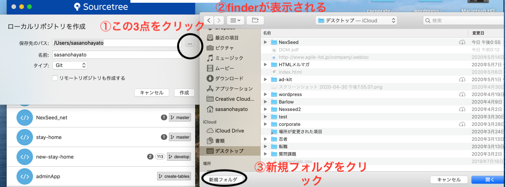
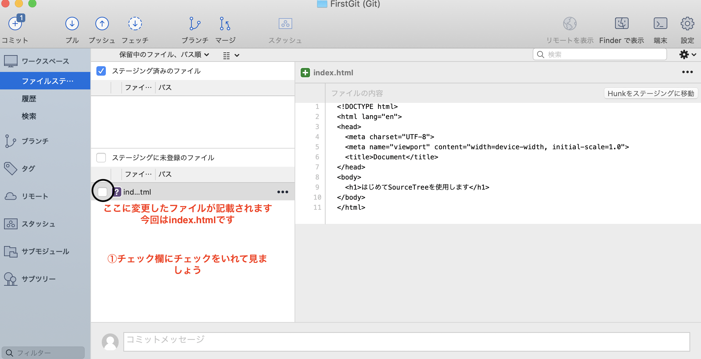

# はじめに
Sourcetreeはプログラムのソースコードを管理するGitを簡単に扱うためのGUIツールです。
- add
- Commit
- Push
 
について実際に手を動かして操作をしながら、SourceTreeの使い方を習得していきましょう。

# 復習
## リポジトリとは
リポジトリファイルとはソース管理の基となるファイルで、「貯蔵庫」という意味になります。
ここにプロジェクト全体の変更点を保存しておき、ファイルをある時点の状態に戻したり、履歴を確認したりすることができるようになります。 
リポジトリファイルには２種類あります。
- ローカルリポジトリ
- リモートリポジトリ

### ローカルリポジトリ
作業中のPC内に存在するリポジトリファイルです。CommitというGitコマンドを使って、変更点の履歴を保存していきます。今回はローカルリポジトリを作成して、Sourcetreeで操作を行います。
.gitは隠しファイルなのでFinderで見ても存在するかわかりません。
ターミナルで隠しファイルを表示するオプションをつけてlsコマンドを実行することで確認できます。
### リモートリポジトリ
ソースを管理する為のサーバー上に存在するリポジトリファイルです。PushというGitコマンドを使って、ローカルリポジトリの履歴をサーバー上にUploadし保存することが可能です。
今回はリモートリポジトリの保存場所として「Github」というホスティングサービスを利用していきます。
### GitコマンドとSourceTree
ソース管理をおこうなう専用のコマンドです。使用するにはPCにGitソフトをインストールする必要がありますが、SourceTreeがインストールされているMacには改めてインストールする必要はありません。
Gitコマンドは通常、ターミナルからコマンドライン(CUI)ベースで実行するものなのですが、Gitコマンドを見やすい形で操作するためのツールがSourceTreeになります。

## 実践
早速実際にSourcetreeを使ってみましょう。

### COMMAND + SPACEでスポットライト検索
「SourceTree」と検索しましょう。 

### ローカルリポジトリの作成
#### step1
起動し、「新規リポジトリ」ボタンを押し、「ローカルリポジトリの作成」をクリックします。 

#### step2
図の通り作業を進めてください 
リポジトリ作成場所はデスクトップフォルダの中に作成します。 
図のようにFinderのように『デスクトップ』という文字が少し薄黒くなっていれば問題ありません。

#### step3 
リポジトリ名の記載を求められるので『FirstGit』とし、作成をクリックしましょう。 
この作業が終われば**ローカルリポジトリの作成**完了です。

#### step4
ローカルリポジトリが本当に完成できているのか確かめましょう。
 
Finderを開いて、『デスクトップ』フォルダの中身をみてみましょう。 

 
FirstGitが確認できますね。

#### step5
SourcetreeでFirstGitを確認しよう。 
一度Sourcetreeを閉じてしまった方や、図のような一覧画面が表示されなくなってしまった方は、再度Sourcetreeを起動し直しましょう。 
スポットライト検索からSourcetreeを開けます。
図のように『FirstGit』が確認できれば、次の作業に進みましょう

#### step6
『FirstGit』をクリックすると下記の図のように表示がでます。 
しかし、**ファイルステータス**や**履歴**をクリックしても何も表示されていません。 
なぜでしょうか 
それもそのはず、実はまだリポジトリを作成しただけでファイルも用意していない、コードも記入していないためです。

#### step7
VS CODEからFirstGitを立ち上げましょう 
スポットライト検索からVS CODEを起動し、VS CODE上で**commmnad+o**を押し、開きたいフォルダを選択します。 
FirstGitを選択しましょう。

#### step8
コードを記入してみましょう 
ここでは簡単にhtmlの雛形を記載してみることにします。 
新規ファイル作成を行い、index.htmlを作成しましょう 
図のようになっていれば、次に進みましょう

#### step9
雛形だけの記載は味気ないので、bodyタグの中に図のように記載しましょう 
記載が終われば、ブラウザで開きましょう。
ブラウザで『はじめてSoureTreeを使用します』と表示がでることを確認してください

#### step10
Sourcetreeを確認してみましょう。（ファイルステータス） 
図のように、先程まで何も表示のなかったSourcetreeに雛形（自分がVS CODE上で記載したコード）が表示されました。

#### step11
- add
- commit
- push
をおこないましょう。

### add
 
図の丸印にチェックをいれるとaddされます。 

### commit
 
commitメッセージを記載し、右下のコミットボタンをクリックしてcommitしましょう 
左サイドバーの『ファイルステージ』から『履歴』に移動してみましょう。 
commitされたことが確認できます。 
 

### push
次にpushボタンをおしてみましょう。 
図のような画面になることを確認してください 
 
pushするブランチが何もないため,pushできません 
**リモートリポジトリが必要になります** 
それではリモートリポジトリを作成していきましょう。

#### いままで結局なにをやってきたのか
ここまでの流れが,何かWebアプリを作成する時に行う作業です。 
ローカルリポジトリをSouretreeから作成し、実際にWebアプリを開発（今回は雛形に『はじめてSoureTreeを使用します』を記載した）。 
add、commitまで行いましが、リモートリポジトリが作成されていないのでpushできませんでした。リモートリポジトリを作成していきます。

### リモートリポジトリの作成
自分のGithubアカウントにアクセスし
Commit、
Commit

変更点を保存するために「作業ツリーのファイル」にティックをつけると変更点のあるファイルが全て「ステージされたファイル」の方へ移動します。（ファイル個別に移動することも可能です）

コミットするためにはメッセージを記載する必要があります。記載しようとすると、下記のような画面が表示されます。

ここでの「コミットに紐づくユーザー情報」というのはGithubアカウント情報になります。事前にGithubでアカウントを作成しておきその情報を入力しておきましょう。
アカウント情報を入力するとメッセージが記載できるようになるので記載してコミットボタンを押します。これでローカルリポジトリに変更点を保存しておくことができました。

Push
ローカルリポジトリにコミットがたまったら、次はそれをリモートリポジトリにPushしましょう。チーム開発で複数人で共有する場合、またバックアップの観点からも定期的なPushが必要です。
Pushを行うにはまずローカルリポジトリとリモートリポジトリの紐付けを行います。
最初にGithubにログインしてからのリモートリポジトリを作っておきましょう。ここでは前提として「https://github.com/ei17ringo/survey」というリモートリポジトリを用意しています。
下図の設定ボタンをクリックして、リモートリポジトリを指定します。

設定が終わった後は、pushを押します。下記画面で左端のティックをつけてOKを押すと完了です。

