# Git操作

## ローカルリポジトリの作成
Sourcetreeで作業します。    
1. 新規リポジトリをクリック
2. ローカルリポジトリを作成をクリック
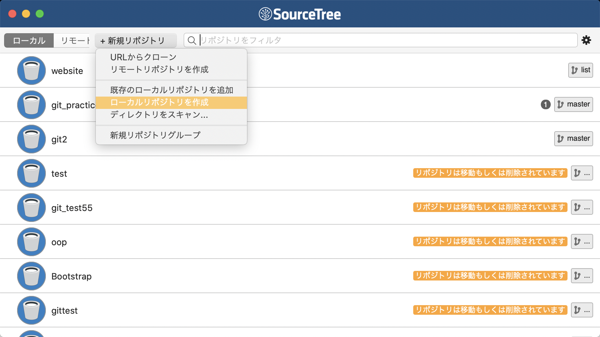

3. 保存先のフォルダを指定して作成をクリック
  ※対象のフォルダは空になってる必要があります。  
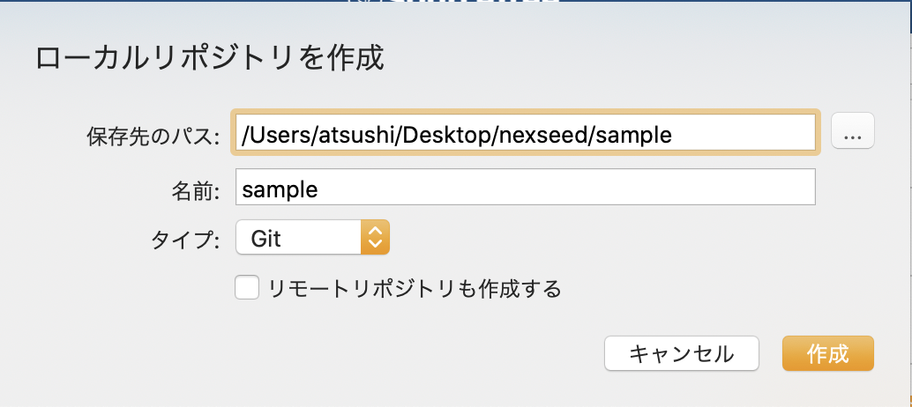

## リモートリポジトリの作成
GitHubで操作します。  
1. 画面右上の+をクリック
2. New repositoryをクリック
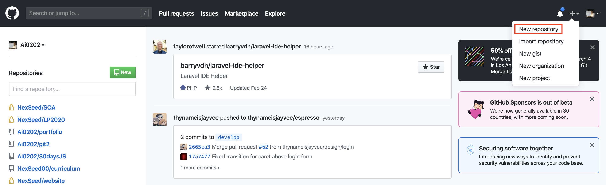
3. リポジトリ名を入力
  ※名前はなんでも問題ないですが、ローカルリポジトリと同名にすることが多いです。  
4. Create Repositoryボタンをクリック
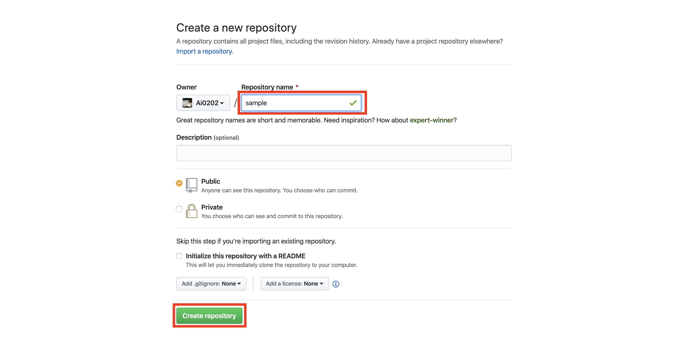
  ※以下の画面が表示されていればOKです。 
  後の作業で必要になるため、赤枠部分をコピーします。   
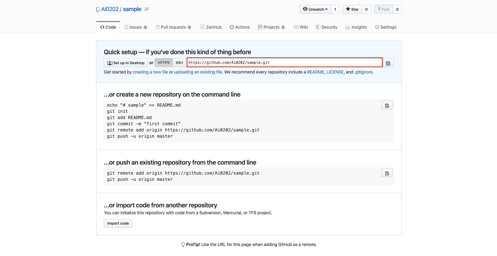

## ローカルとリモートの連携
1. 画面右上の設定をクリック  
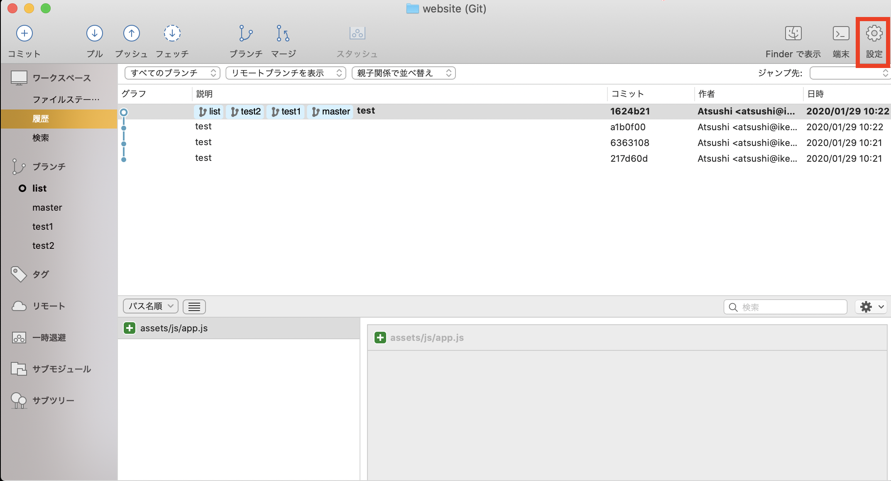

2. 画面上部のリモートをクリック  
3. 画面左下の追加をクリック  
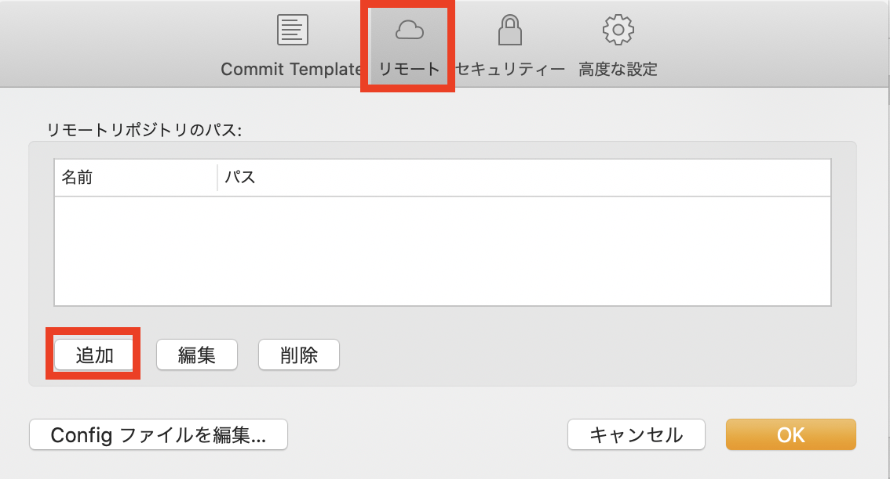

4. リモートの名前に `origin` を入力
5. URL / パスに作成したリモートリポジトリのURLを貼り付け  
   ※リモートリポジトリの作成の最後でコピーしたURL
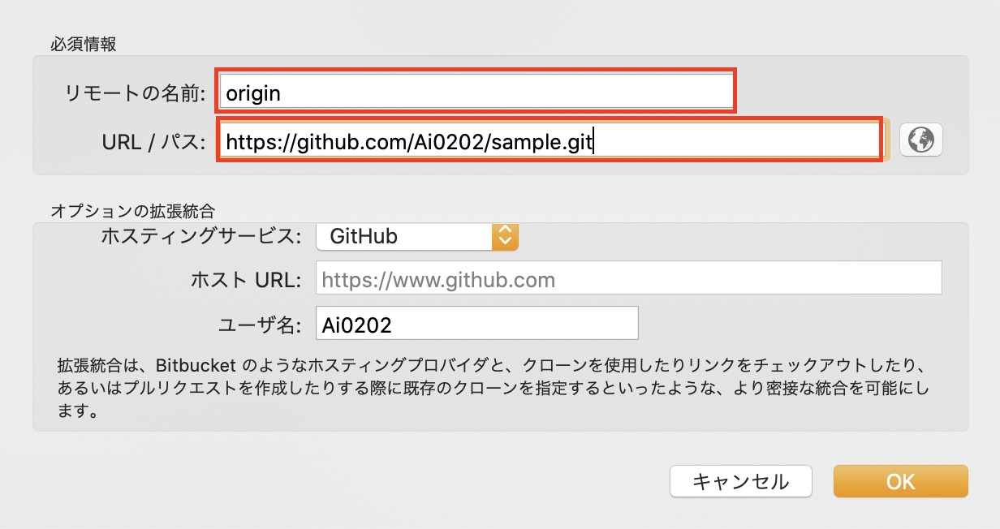

## ファイル編集からpushまでの手順
### add
1. 作業ツリーのファイルのチェックボックスをチェック
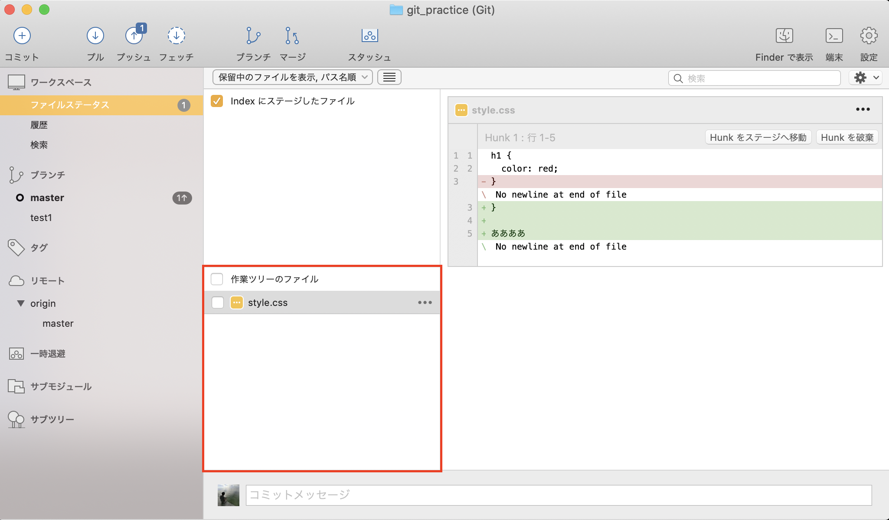

### commit
1. コミットメッセージを画面下部に入力
2. 画面右下のコミットボタンをクリック 
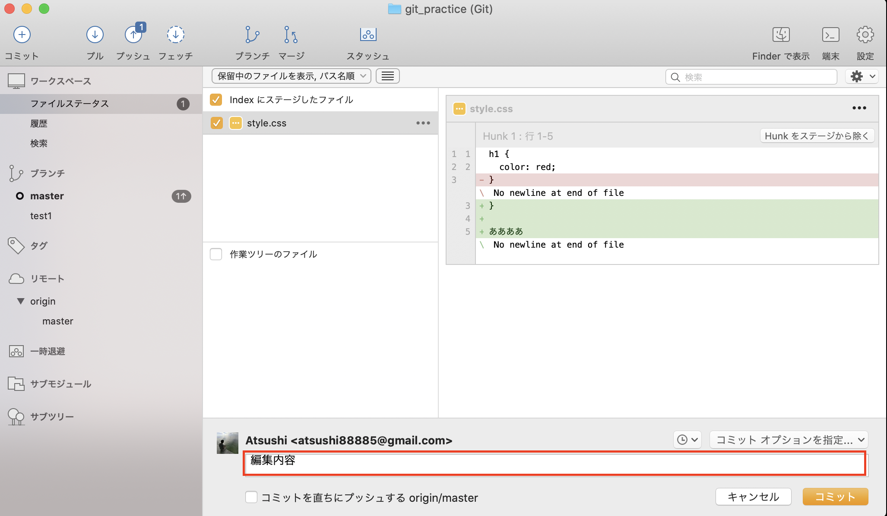

### push
1. 画面上部のプッシュをクリック
  ※プッシュボタンには数字が表示される場合とされない場合がありますが、今は気にしなくてよいです。  
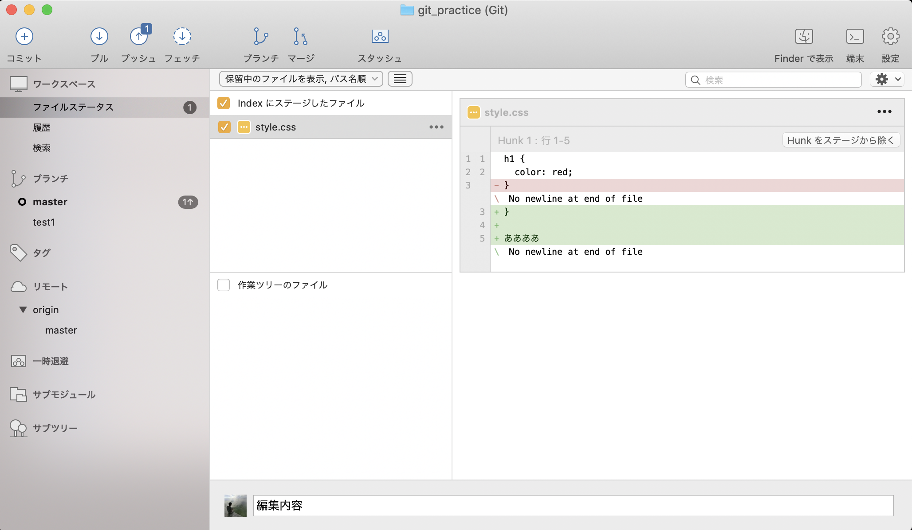

2. プッシュしたいブランチにチェック
3. OKをクリック
  ※エラーが表示されていなければ正常に完了してます。  
    リモートリポジトリ(GitHub)を確認してみましょう。
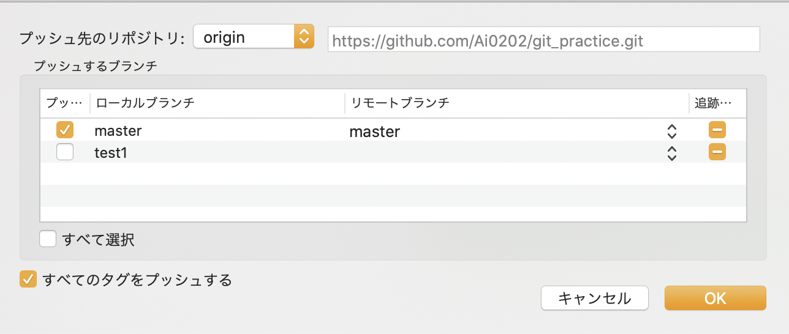

## PRのやり方
https://qiita.com/obscure723/items/5265556d1b89e77c456b