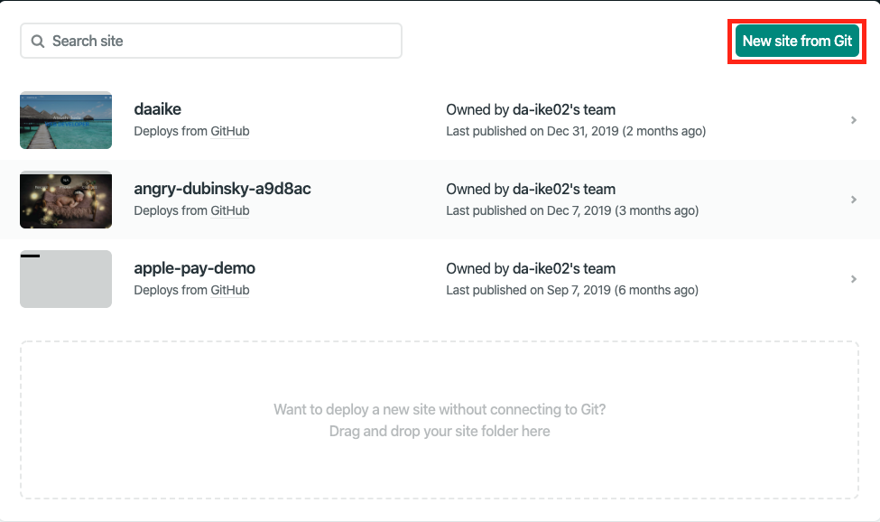
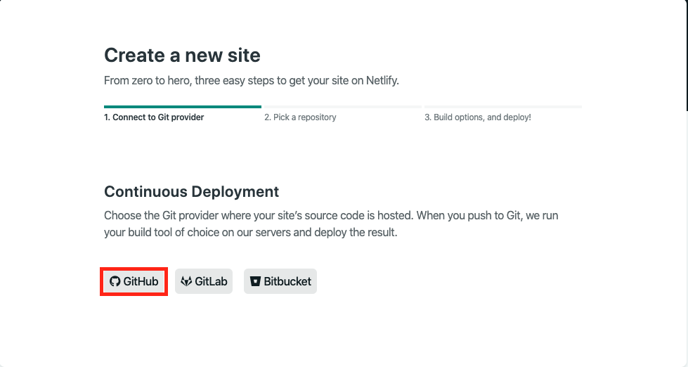
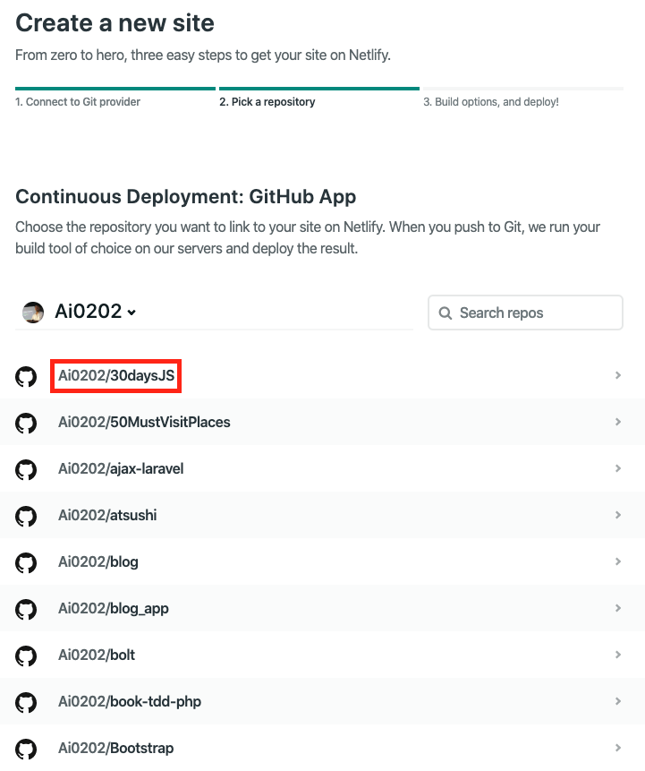
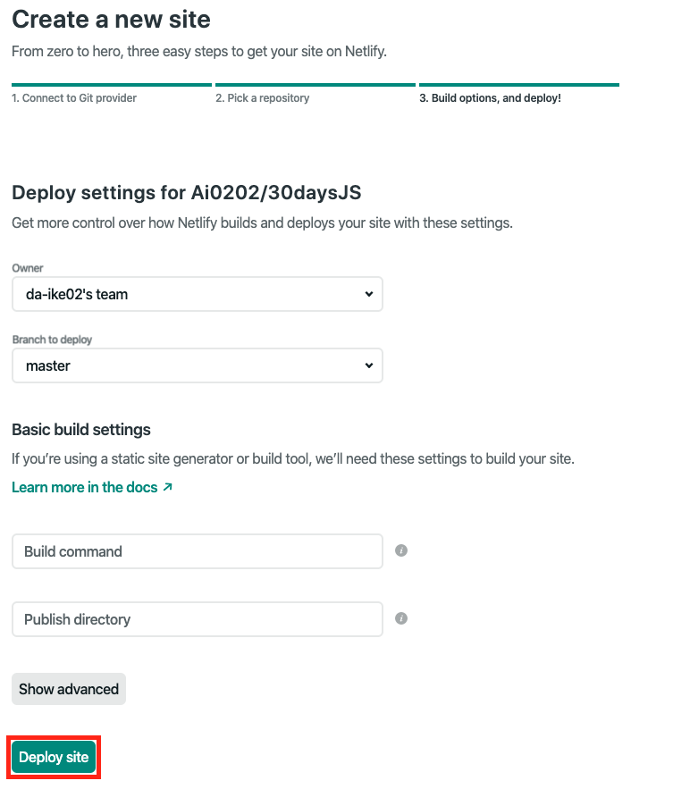
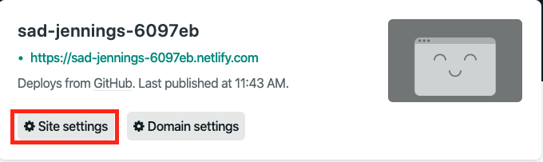
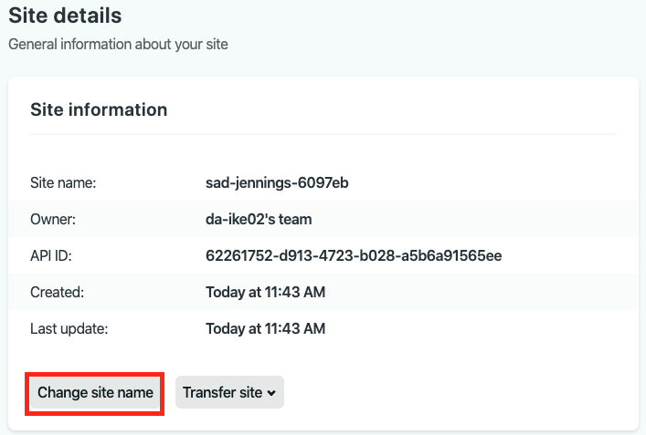
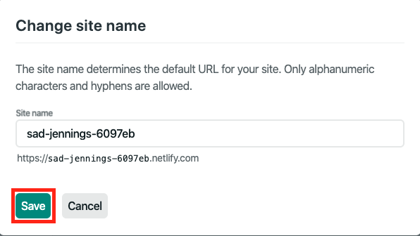

# Netlifyを使用したWebサイトのデプロイ

## デプロイ手順
1. 画面右上の `New site from Git` をクリック

2. 画面左下の `GitHub` をクリック

  ※初回は緑色の `Authorize`  ボタンなどが表示されるためクリック
3. GitHubのリポジトリの一覧が表示されるため、デプロイしたいリポジトリを選択

4. 画面下部の `Deploy site` をクリック

## URLの変更
上記手順でデプロイは完了していますが、  
URLがわかりにくいため、修正します。  
1. `Site Settings` をクリック

2. `Change site name` をクリック

3. Site nameを変更して `Save` をクリック
